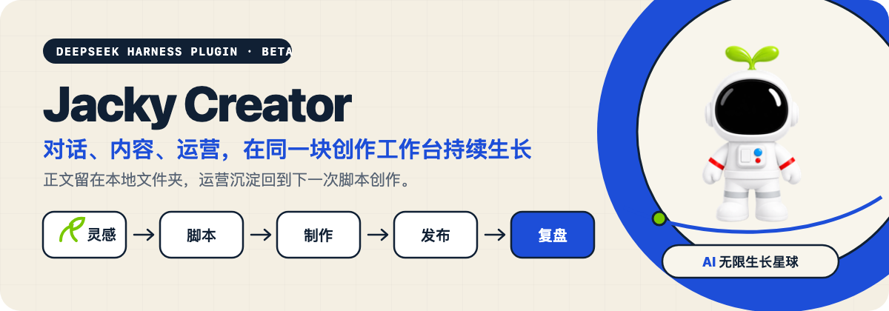

<p align="center">
  
</p>

<p align="center">
  <strong>一个面向内容创作者的 DeepSeek Harness 本地工作台。</strong><br>
  灵感进入内容管线，运营复盘沉淀为知识，再回到下一次脚本创作。
</p>

> [!WARNING]
> 这是 `v0.1.0-beta.1` 测试版，当前不在插件市场上架。请使用下面固定版本的 GitHub Release 安装包，不要安装未知分支。Beta 首轮以 macOS + DSH Desktop 2.0.2 为验收环境；Windows 仍需真实用户测试。

## Jacky Creator 是什么

Jacky Creator 把 DeepSeek Harness 的对话能力和本地创作目录连起来，并增加内容与运营工作区。它不建立封闭数据库，也不把正文藏进应用：一条内容仍然对应一个普通文件夹，AI、编辑器和你自己都能继续读写。

```text
灵感 → 选题 → 脚本 → 演示 / 视频 / 字幕 / 封面 → 发布 → 复盘
  ↑                                                  │
  └────────── 运营规则、模板和知识回到下一次创作 ────────┘
```

你会看到四个核心入口：

- **对话**：继续使用 DSH Agent，并把当前内容和运营知识带进对话。
- **内容**：按本地文件夹管理脚本、视频、字幕、封面、文章和发布状态。
- **运营**：查看今日推进、档期、内容管线、阶段目标和发布后复盘。
- **灵感**：用卡片记录想法、保留标签和分级，确认后推进为真实内容项目。

## 10 分钟安装测试版

### 第 1 步：安装 DSH Desktop

下载并安装 [DSH Desktop 2.0.2](https://github.com/anywhere-labs/dsh-desktop/releases/tag/v2.0.2)。

DSH Desktop 是社区维护的桌面客户端，不是 DeepSeek 官方桌面产品。Jacky Creator 是 DeepSeek Harness 社区插件，也不代表 DeepSeek 官方产品。

### 第 2 步：安装 Jacky Creator

打开 DSH Desktop 的内置终端，完整复制下面一行并回车：

```bash
dsh plugin add https://github.com/Jackywxsz/DSH-Creator/releases/download/v0.1.0-beta.1/dsh-oil-creator-0.1.0-beta.1.tgz
```

安装完成后彻底退出并重新打开 DSH Desktop。侧边栏左上角出现 **Jacky Creator**，并能进入“内容 / 运营 / 灵感”，即表示插件已经加载。

> [!TIP]
> 测试版固定到 `v0.1.0-beta.1`，这样以后仓库继续开发也不会悄悄改变你本机的版本。

### 第 3 步：让 AI 完成首次配置

新建会话，选择 `standard` 或 `code` Agent，然后直接发送：

> 检查并配置 Jacky Creator，找到适合的内容目录，先预览准备修改的设置，并告诉我还缺哪些可选能力。

AI 会先只读检查目录和可选工具；创建目录、保存配置或批量重命名前都会先给你预览并等待确认。

### 第 4 步：创建第一条内容

继续发送：

> 今天做一期 DeepSeek Harness 安装上手。新建内容项目，把选题写进 topic.md，再给我一个脚本初稿。

随后可以在“内容”查看资产状态，在“运营”安排推进，也可以把新灵感继续记录到灵感库。

更详细的逐步说明见 [小白安装与首次使用](docs/installation.md)。

## 安装失败怎么办

先确认使用的是 **DSH Desktop 内置终端**，而不是普通聊天输入框。

测试版使用预构建 `.tgz`，正常情况下不会触发源码构建授权。如果你安装的是 `github:Jackywxsz/DSH-Creator#...` 源码地址，pnpm 10 会先要求在目标 Profile 的 `pnpm-workspace.yaml` 中允许 `dsh-oil-creator` 构建；这条路径只供开发者使用，小白用户请改回上面的 Release 安装包。

如果左侧仍没有 Jacky Creator：

1. 完全退出并重新打开 DSH Desktop。
2. 确认命令末尾版本号是 `v0.1.0-beta.1`。
3. 到 [GitHub Issues](https://github.com/Jackywxsz/DSH-Creator/issues) 提交系统版本、DSH Desktop 版本和安装日志；不要粘贴 API Key。

## 本地文件如何组织

```text
~/Movies/视频项目/
└── 2026-08-25_DeepSeek Harness 上手/
    ├── topic.md
    ├── script.md
    ├── DeepSeek Harness 上手.mp4
    ├── DeepSeek Harness 上手.srt
    ├── DeepSeek Harness 上手_subtitled.mp4
    ├── DeepSeek Harness 上手_3x4.png
    ├── DeepSeek Harness 上手_4x3.png
    ├── DeepSeek Harness 上手_16x9.png
    ├── publish-package.json
    └── 公众号文章/
```

正文和产物保存在你选择的内容目录。工程绑定、运营状态、标签、发布标记和同步数据保存在 `~/.dsh-oil-creator/`。保留旧目录名是为了让现有测试用户升级时不丢数据。

## 核心能力与可选扩展

不安装任何 Jacky 私有 Skill，也可以使用核心内容库、运营工作台、灵感库和脚本规则。

| 能力 | Beta 状态 | 额外依赖 |
| --- | --- | --- |
| 对话、内容、运营、灵感 | 核心能力 | 无 |
| 本地脚本与项目目录 | 核心能力 | 无 |
| 字幕转录、校对、烧录 | 可选 | `oil-subtitle`、DashScope Key |
| Jacky 三画幅封面 | 可选 | `jacky-cover`、`oil-cover`、ZenMux Key |
| 演示动画 | 可选 | `jacky-motion2-0` |
| Screen Studio 工程 | 可选，仅 macOS | `screen-studio-editor` |
| 多平台草稿与数据回收 | 可选，仅 macOS | Ego Lite、`video-publisher` |

缺少可选依赖时，只关闭对应环节，不应影响核心工作台。Jacky Creator 不替你自动完成录制、剪辑、最终发表，也不会在未确认时上传内容。

## 数据、权限和安全边界

- 正文、视频、字幕、封面和文章留在用户选择的本地目录。
- API Key 使用 DSH 凭据服务保存，界面只显示“已配置 / 未配置”。
- 字幕、封面和平台同步只有在用户主动启用对应能力时才访问外部服务。
- 目录创建、批量重命名、运营知识确认和配置保存遵循“先预览、再确认、后执行”。
- 插件卸载不会主动删除内容目录或 `~/.dsh-oil-creator/` 数据。

安全问题请按 [Security Policy](SECURITY.md) 私下报告，不要在公开 Issue 中附带密钥、私人路径或未脱敏内容。

## 更新与卸载

Beta 期间每个版本都固定到 Git Tag。升级时先卸载插件包，再安装 README 指定的新 Tag；本地内容和 `~/.dsh-oil-creator/` 状态目录会保留。

```bash
dsh plugin remove dsh-oil-creator
dsh plugin add https://github.com/Jackywxsz/DSH-Creator/releases/download/v0.1.0-beta.1/dsh-oil-creator-0.1.0-beta.1.tgz
```

只卸载：

```bash
dsh plugin remove dsh-oil-creator
```

执行后重启 DSH Desktop。不要手动编辑 `~/.dsh/profiles/*/package.json`，也不要把仓库里的 `cordis.patch.yml` 复制进用户 Profile。

## 兼容性

| 环境 | 当前策略 |
| --- | --- |
| DSH Desktop 2.0.2 | Beta 首要支持目标 |
| DeepSeek Harness 0.1.1-rc.2 | 构建与插件 API 基线 |
| macOS | 首轮完整验收环境 |
| Windows x64 | 核心能力待真实用户验证；macOS 专属扩展不可用 |
| Node.js | 源码开发需要 22.19 或更高版本 |

DeepSeek Harness 仍处于 Developer Preview。上游破坏性升级不会自动进入稳定版；每次升级 DSH 基线都必须重新通过测试、打包和安装门禁。

## 插件市场计划

本 Beta 暂不上架市场。最终路径已经确定为：

1. GitHub 作为源码、Issue 和版本真源。
2. 稳定版发布不可变的 npm 包。
3. 通过 `dsh-plugin` Topic 和 `dsh-market` 提交市场收录。
4. 市场卡片只安装经过验证的稳定版本，不跟随开发分支。

上架材料、审核门禁和回滚方案见 [发布与插件市场路径](docs/distribution.md)。

## 开发与验证

```bash
git clone https://github.com/Jackywxsz/DSH-Creator.git
cd DSH-Creator
pnpm install --frozen-lockfile
pnpm check
```

正式提交、Tag 或 Release 前还必须运行：

```bash
pnpm release:check
```

开发环境和隔离 Profile 见 [实验环境](docs/lab-development.md)。插件实现、Bundle Patch 与 DSH 规范边界见 [实现说明](docs/implementation.md)。

## 文档

- [小白安装与首次使用](docs/installation.md)
- [日常使用与完整工具说明](docs/usage.md)
- [内容文件夹约定](docs/files.md)
- [Creator Cockpit 使用与架构](docs/creator-cockpit.md)
- [插件实现与兼容性说明](docs/implementation.md)
- [发布与插件市场路径](docs/distribution.md)
- [参与贡献](CONTRIBUTING.md)

## License 与品牌资产

代码沿用 [MIT License](LICENSE)。Jacky Creator 名称、芽仔形象、Logo 和品牌视觉不随 MIT 代码许可自动授权，具体边界见 [品牌资产说明](BRAND_ASSETS.md)。原项目和上游贡献者的 MIT 归属继续保留。
