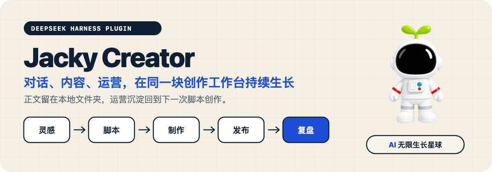

<p align="center">
  
</p>

<p align="center">
  <strong>一个面向内容创作者的 DeepSeek Harness 本地工作台。</strong><br>
  从灵感和脚本，到制作、发布与复盘，都在同一处推进。
</p>

<p align="center">
  <a href="https://github.com/Jackywxsz/DSH-Creator/actions/workflows/ci.yml"></a>
  <a href="https://github.com/Jackywxsz/DSH-Creator/releases"></a>
  <a href="./LICENSE"></a>
</p>

<p align="center">
  <a href="./docs/installation.md">安装指南</a> ·
  <a href="./docs/usage.md">使用说明</a> ·
  <a href="./CHANGELOG.md">更新记录</a> ·
  <a href="./SECURITY.md">安全说明</a>
</p>

## Jacky Creator 是什么

Jacky Creator 把 DeepSeek Harness 的对话能力和本地创作目录连起来，并增加内容、运营和灵感工作区。每条内容仍是一个普通文件夹，AI、编辑器和你自己都能继续读写。

```text
灵感 → 选题 → 脚本 → 演示 / 视频 / 字幕 / 封面 → 发布 → 复盘
  ↑                                                  │
  └────────── 运营规则、模板和知识回到下一次创作 ────────┘
```

- **对话**：使用 DSH Agent，并把当前内容和运营知识带进对话。
- **内容**：管理脚本、视频、字幕、封面、文章和发布状态。
- **运营**：查看今日推进、档期、内容管线、阶段目标和发布后复盘。
- **灵感**：记录想法、标签和分级，确认后推进为内容项目。

## 安装

### 1. 确认软件与版本

**主维护通道是官方 DeepSeek Harness 桌面端和官方 Web UI。** Jacky Creator 是独立社区插件，不是 DeepSeek 官方插件。

| 使用入口 | 当前适配版本 | 安装目标 |
| --- | --- | --- |
| 官方 Electron 桌面端 | Harness `0.2.0-rc.2` + Creator `0.1.0-beta.9` | 桌面端自己的 `desktop` Profile |
| 官方 Web UI（由官方 CLI 启动） | `@deepseek-ai/dsh@0.2.0-rc.2` + Creator `0.1.0-beta.9` | CLI 的 `web` Profile |
| 社区桌面封装 / 分支 | 以其内置 Harness 运行时与插件 API 为准 | 使用该客户端自己的插件管理入口 |

桌面用户从 [DeepSeek 官网](https://www.deepseek.com/zh/download/) 获取官方 Harness，先确认版本匹配。Web UI 用户按下面的 CLI 步骤安装。当前已验证 macOS；不能据此推定所有系统或后续 Harness 版本兼容。

社区版保留兼容支持，但不作为主要适配、回归和发布验收通道，也不承诺逐个跟进其私有改动。社区客户端的应用版本号不等于内置 Harness 版本；只有运行时和 API 匹配时才可能使用同一插件包。

### 2. 安装 Jacky Creator

`0.1.0-beta.9` 适配官方 Harness `0.2.0-rc.2`，安装包见 [GitHub Release](https://github.com/Jackywxsz/DSH-Creator/releases/tag/v0.1.0-beta.9)。市场若仍提供 `beta.8`，请使用下面的固定版本安装命令，不要对旧版授予版本豁免。

**A. 官方桌面端（推荐）**

打开侧栏“插件”，通过内置插件管理器添加下面的成品包 URL，或从 [Release](https://github.com/Jackywxsz/DSH-Creator/releases/tag/v0.1.0-beta.9) 下载 `.tgz` 后添加：

```text
https://github.com/Jackywxsz/DSH-Creator/releases/download/v0.1.0-beta.9/jacky-creator-0.1.0-beta.9.tgz
```

如已安装桌面版附带的 `dsh` 命令，也可在终端安装到 `desktop` Profile：

```bash
dsh plugin --profile desktop add https://github.com/Jackywxsz/DSH-Creator/releases/download/v0.1.0-beta.9/jacky-creator-0.1.0-beta.9.tgz
```

**B. 官方 Web UI**

准备 Node.js `>=22.19.0`。首次使用官方 CLI 时执行以下步骤；已有匹配版本可跳过第一行。`dsh --version` 应显示 `0.2.0-rc.2`：

```bash
npm install -g @deepseek-ai/dsh@0.2.0-rc.2
dsh --version
dsh plugin --profile web add jacky-creator@0.1.0-beta.9
dsh web
```

在浏览器打开 `dsh web` 启动时输出的本地地址，即进入官方 Web UI。也可以用固定 Release 地址替换上面的插件安装命令：

```bash
dsh plugin --profile web add https://github.com/Jackywxsz/DSH-Creator/releases/download/v0.1.0-beta.9/jacky-creator-0.1.0-beta.9.tgz
```

桌面与 Web 是两个独立安装目标：安装到 `web` 不会自动出现在桌面端。npm 安装的 CLI 不能管理 `desktop`；如果两种 CLI 并存，请确认当前执行的是对应宿主的命令。

安装完成后彻底退出并重启当前宿主，点击侧栏 **Jacky Creator** 入口，检查“内容 / 运营 / 灵感”和“设置 → 内置插件 → Jacky Creator”均能打开。

### 3. 完成首次配置

新建会话，选择标准模式，然后发送：

> 帮我配置 Jacky Creator：选择本地内容目录，先预览准备修改的设置，确认后再保存。

配置完成后，直接告诉 AI 想做的内容主题，就可以新建项目、整理选题并生成脚本初稿。

完整步骤见 [安装与首次使用](docs/installation.md)。

## 本地文件

```text
内容目录/
└── YYYY-MM-DD_内容标题/
    ├── topic.md
    ├── script.md
    ├── 内容标题.mp4
    ├── 内容标题.srt
    ├── 内容标题_16x9.png
    └── 公众号文章/
```

正文和产物保存在你选择的内容目录。Jacky Creator 只在本机保存工作台设置、运营状态和发布记录，不会把正文搬进封闭数据库。

## 核心能力

不安装额外 Skill，也可以使用内容库、运营工作台、灵感库和脚本规则。字幕、封面、演示动画、Screen Studio 和多平台发布属于可选扩展，缺少时不会影响核心工作台。

| 能力 | 说明 |
| --- | --- |
| 内容工作流 | 管理选题、脚本、制作资产和发布状态 |
| 运营工作台 | 管理档期、目标、复盘和内容推进 |
| 灵感库 | 记录想法并推进为真实内容项目 |
| 可选制作能力 | 字幕、封面、演示动画和多平台发布 |

详细能力和依赖见 [使用说明](docs/usage.md)。

## 数据与权限

- 正文、视频、字幕、封面和文章留在用户选择的本地目录。
- API Key 由 DSH 凭据服务保存，界面只显示配置状态。
- 目录创建、批量重命名和配置保存会先预览，再等待确认。
- 外部服务只在用户主动启用对应能力时访问。
- 插件不会在卸载时删除内容目录。

安全问题请按 [Security Policy](SECURITY.md) 私下报告，不要在公开 Issue 中附带密钥、私人路径或未脱敏内容。

## 常见问题

如果侧边栏没有出现 Jacky Creator：

1. 确认插件安装到正在使用的 Profile（官方桌面端为 `desktop`，CLI 为 `web`）。
2. 彻底退出并重新打开 DeepSeek Harness。
3. 仍然失败时，到 [GitHub Issues](https://github.com/Jackywxsz/DSH-Creator/issues) 提交系统版本、DeepSeek Harness 版本和脱敏后的安装日志。

不要手动修改 DSH Profile 的 `package.json` 或 `cordis.patch.yml`。

## 兼容性

| 插件版本 | Harness 运行时 | 状态 |
| --- | --- | --- |
| `0.1.0-beta.9` | `0.2.0-rc.2` | macOS 官方 Electron / CLI 验收通过；范围见验收记录 |
| `0.1.0-beta.8` | `0.1.1-rc.2` | 历史版本，不能安装到 `0.2.0-rc.2` |

本轮已在 macOS 官方 Electron 桌面端与 CLI/Web 隔离环境验收；原生目录弹窗、系统文件打开结果、其他 Harness 版本和 Windows x64 尚未完成完整验证，详见[验收记录](docs/harness-0.2.0-rc.2-validation.md)。Screen Studio、Ego Lite 等可选扩展仅支持 macOS。

遇到 `incompatible with dsh` 或 `dsh: nothing was installed`，表示插件未安装成功。`allow-version` 只豁免检查，不修复 API；请安装匹配版本，不要为旧插件降级宿主。

## 插件市场

已收录到 [awesome-dsh-plugin](https://github.com/awesome-dsh-plugin/awesome-dsh-plugin)。beta.9 的目录更新见 [PR #6927](https://github.com/awesome-dsh-plugin/awesome-dsh-plugin/pull/6927)；是否已生效以 PR 合并状态和市场卡片实际安装包为准。若卡片仍指向 beta.8，请使用上面的 beta.9 固定地址或 npm 命令。

社区插件市场是分发入口，社区桌面客户端是另一种宿主；使用社区市场不改变“官方桌面端 / 官方 Web UI 为主维护通道”的原则。

## 文档与开发

- [安装与首次使用](docs/installation.md)
- [日常使用](docs/usage.md)
- [内容文件夹约定](docs/files.md)
- [参与贡献](CONTRIBUTING.md)

本地开发：

```bash
pnpm install --frozen-lockfile
pnpm check
```

## 项目来源

Jacky Creator 基于上游开源项目 [dsh-oil-creator](https://github.com/oil-oil/dsh-oil-creator) 的本地内容工作流继续开发，并融合了 Jacky 原 Creator Cockpit 的运营方法与界面经验。感谢原项目作者和贡献者。

## License 与品牌资产

代码沿用 [MIT License](LICENSE)。Jacky Creator 名称、芽仔形象、Logo 和品牌视觉不随 MIT 代码许可自动授权，具体边界见 [品牌资产说明](BRAND_ASSETS.md)。原项目和上游贡献者的 MIT 归属继续保留。
