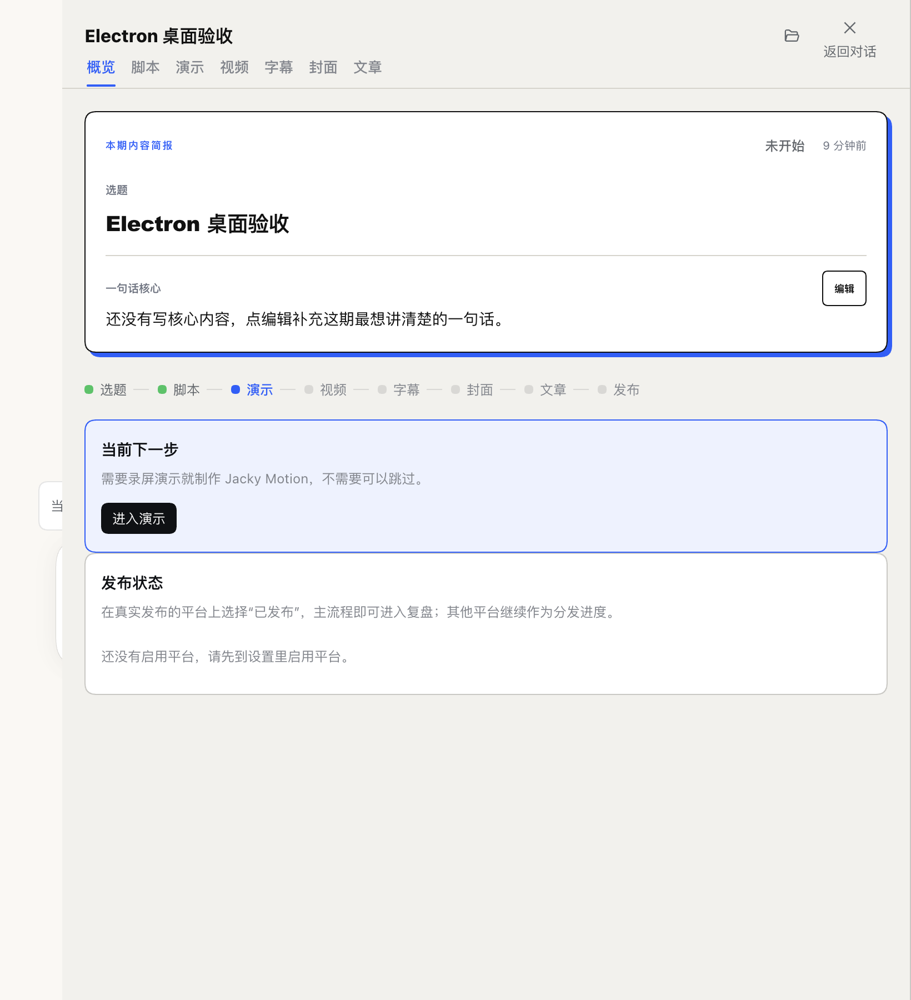

# 官方 Harness 0.2.0-rc.2 适配验收

CLI/Web 验收：2026-10-04；官方 Electron 验收：2026-10-09。插件：`jacky-creator@0.1.0-beta.9`。本页记录源码适配与隔离验收结果；公开分发状态以 GitHub Release、npm registry 和市场上游条目为准。

## 原因和迁移

旧 beta.8 的 DSH peer dependencies 固定为 `0.1.1-rc.2`，官方 `0.2.0-rc.2` 安装器会拒绝安装。beta.9 声明精确宿主版本，并完成实际 API 迁移：

- 移除旧 `dsh-client-runtime`，改用拆分后的工作区、会话和渲染服务。
- 目录选择改为 `uiWorkspace`，本地路径打开改为 `remote.session.openWorkspacePath`。
- 凭据改为 `remote.credentials`；显式注入 `remote.credentials` / `remote.session`，防止设置页在新版服务访问检查下渲染失败。
- 设置入口改为 `settings.plugins.tab`，关闭重复生成的配置表单。
- 同步新版图标、Markdown labels 和 Typert codec `create()` 契约。
- 固定开发环境中的官方间接 peer 版本，避免 pnpm 混装旧 DSH 组件导致启动失败。

依据为官方 npm 包 `@deepseek-ai/dsh@0.2.0-rc.2` 及其同版组件的 README、类型定义和实现；核对日期同上。桌面入口见 [DeepSeek 官网](https://www.deepseek.com/zh/download/)。

## 已验证

运行环境为 macOS、官方 npm CLI `0.2.0-rc.2`（`web` Profile）和官方 DeepSeek Harness.app `0.2.0-rc.2`（`desktop` Profile）。桌面构建为 `5e9e301dd9dc8923b2762f76dacfc5751f6ca851`。验收使用独立 `DSH_HOME`、Electron 用户数据目录与本地端口；内容、运营和设置均为虚构验收数据。

官方桌面 CLI 安装与卸载均使用应用附带的 `dsh-desktop-host`，未使用版本豁免。桌面 UI 通过已授权的 Electron CDP 操作；实际窗口截图已人工查看。

| 检查 | 结果 |
| --- | --- |
| TypeScript、57 个测试文件 / 351 项测试、构建 | 通过 `pnpm check` |
| 官方真实兼容性判定函数 | beta.9 通过；模拟 beta.8 被拒；旧宿主被拒 |
| 成品 `.tgz` 安装、替换候选包后重启 | 通过；未授予版本豁免 |
| 内容创建、详情、脚本编辑 | 页面可用，脚本实际保存为 `script.md` |
| 运营与灵感 | 页面可用，虚构灵感实际持久化 |
| 设置页与凭据状态 | 页面可用，密钥显示配置状态，脚本规则保存到 overlay |
| 候选包更新后的数据 | 内容和灵感保留 |
| 隔离 Profile 卸载 | 插件移除，内容、设置和灵感数据保留 |
| 宽屏 1440px / 窄屏 820px | 实际截图检查通过，无页面横向溢出或 slot error |

同版本候选包复测使用不同的文件路径，避免安装器复用先前的本地压缩包缓存。最终公开发布应只使用一个冻结包，不覆盖同版本文件。

## 桌面端补充证据

- 实际创建“Electron 桌面验收”，编辑脚本并核对磁盘 `script.md`。
- 灵感“Electron 持久化验收灵感”和脚本规则分别写入运营状态与设置 overlay。
- 从不同路径更新同版本候选包后，完整退出并重启官方 Electron；内容、脚本、灵感、设置均在界面成功回读，slot error 为 0。
- 卸载 `desktop` Profile 后，5 个内容、设置与运营文件的 SHA-256 与卸载前一致。
- 实际窗口宽度 1440px 和 820px 下无页面横向溢出；截图如下。

## 尚未覆盖

- 原生目录选择弹窗的选择闭环；系统文件打开按钮已点击，但未独立确认系统文件管理器的最终状态，因此不计为完成验收；Windows。
- 真实模型调用、付费字幕/封面、视频制作和对外发布扩展。
- 公开分发核验独立于本页运行时验收：GitHub Release / npm 需比对制品字节；市场须等待上游合并与实际条目回读。

## 实际页面

截图仅包含虚构验收内容，不含个人创作资料或凭据。

### 宽屏

### 窄屏

### 官方 Electron 宽屏

### 官方 Electron 窄屏

