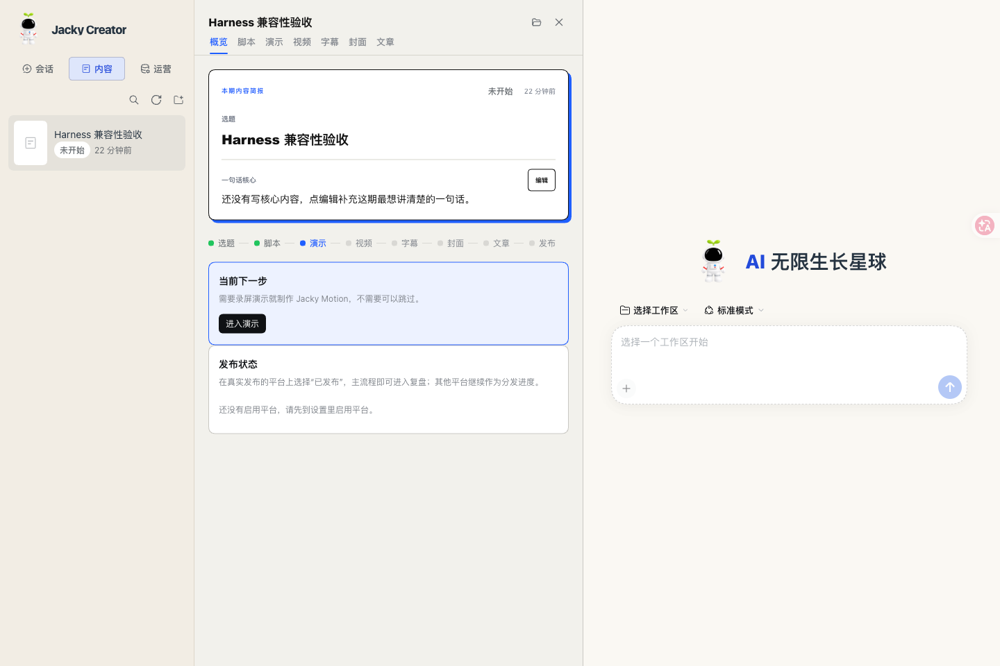
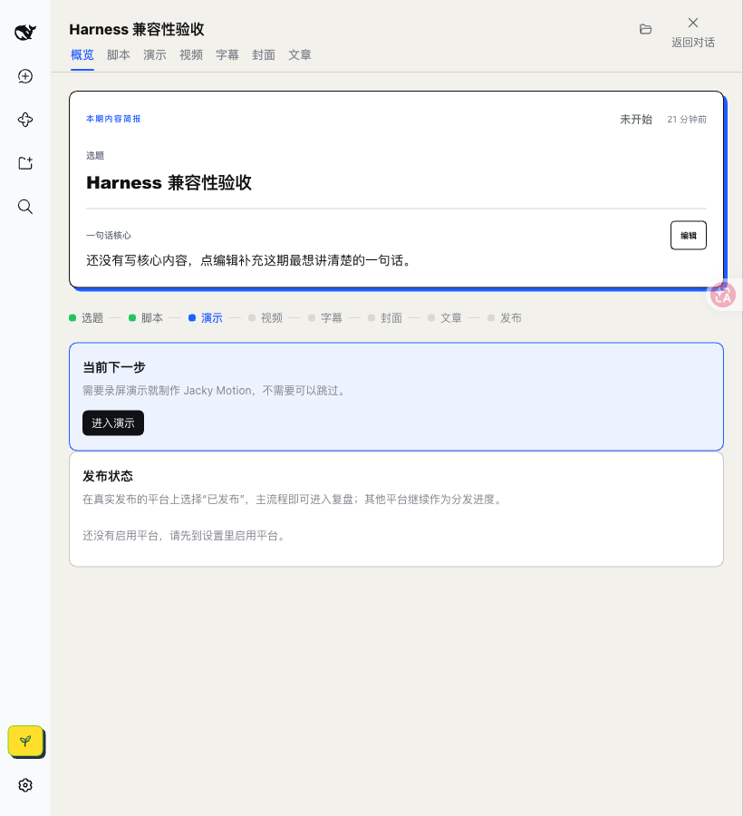

# 官方 Harness 0.2.0-rc.2 适配验收

日期：2026-10-04。插件候选：`jacky-creator@0.1.0-beta.9`。本页记录源代码适配与隔离环境结果，不代表该版本已公开发布。

## 原因和迁移

旧 beta.8 的 DSH peer dependencies 固定为 `0.1.1-rc.2`，官方 `0.2.0-rc.2` 安装器会拒绝安装。beta.9 声明精确宿主版本，并完成实际 API 迁移：

- 移除旧 `dsh-client-runtime`，改用拆分后的工作区、会话和渲染服务。
- 目录选择改为 `uiWorkspace`，本地路径打开改为 `remote.session.openWorkspacePath`。
- 凭据改为 `remote.credentials`；显式注入 `remote.credentials` / `remote.session`，防止设置页在新版服务访问检查下渲染失败。
- 设置入口改为 `settings.plugins.tab`，关闭重复生成的配置表单。
- 同步新版图标、Markdown labels 和 Typert codec `create()` 契约。
- 固定开发环境中的官方间接 peer 版本，避免 pnpm 混装旧 DSH 组件导致启动失败。

依据为官方 npm 包 `@deepseek-ai/dsh@0.2.0-rc.2` 及其同版组件的 README、类型定义和实现；核对日期同上。桌面入口见 [DeepSeek 官网](https://www.deepseek.com/zh/download/)。

## 已验证

运行环境为 macOS、官方 npm CLI `0.2.0-rc.2`、独立 `DSH_HOME` 与 `web` Profile。内容、运营和设置使用临时数据目录。

| 检查 | 结果 |
| --- | --- |
| TypeScript、57 个测试文件 / 351 项测试、构建 | 通过 `pnpm check` |
| 官方真实兼容性判定函数 | beta.9 通过；模拟 beta.8 被拒；旧宿主被拒 |
| 成品 `.tgz` 安装、替换候选包后重启 | 通过；未授予版本豁免 |
| 内容创建、详情、脚本编辑 | 页面可用，脚本实际保存为 `script.md` |
| 运营与灵感 | 页面可用，虚构灵感实际持久化 |
| 设置页与凭据状态 | 页面可用，密钥显示配置状态，脚本规则保存到 overlay |
| 候选包更新后的数据 | 内容和灵感保留 |
| 隔离 Profile 卸载 | 插件移除，内容、设置和灵感数据保留 |
| 宽屏 1440px / 窄屏 820px | 实际截图检查通过，无页面横向溢出或 slot error |

同版本候选包复测使用不同的文件路径，避免安装器复用先前的本地压缩包缓存。最终公开发布应只使用一个冻结包，不覆盖同版本文件。

## 尚未覆盖

- 官方 Electron 桌面端 `desktop` Profile 的实际安装及界面验收；CLI/Web 结果不能替代桌面封装验收。
- 原生目录选择弹窗、系统文件打开、Windows。
- 真实模型调用、付费字幕/封面、视频制作和对外发布扩展。
- GitHub Release、npm 和插件市场公开分发。

## 实际页面

截图仅包含虚构验收内容，不含个人创作资料或凭据。

### 宽屏

### 窄屏

